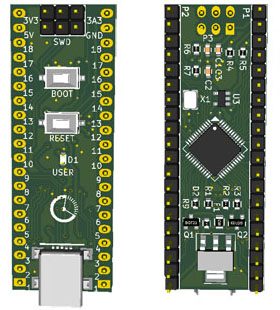

## STM32duino-mini
mini version of stm32duino compatible maple mini

## Content

* Datasheet: chip documents
* Schematic: pdf file of board schematic
* Gerber: board gerber file
* Image: the board images

## License
[MIT](https://raw.githubusercontent.com/Lembed/Lembed-STM32mini-Hardware/master/LICENSE)
#
